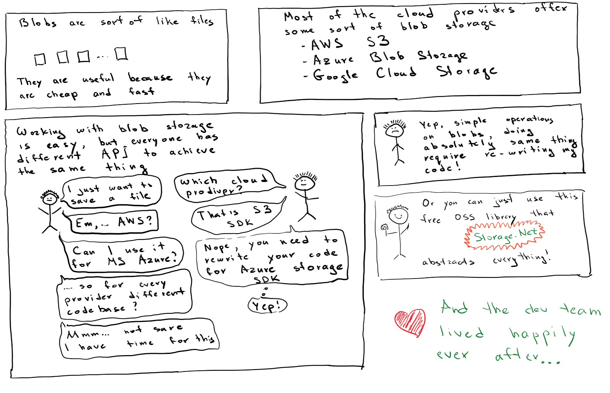

# Storage.Net
### One Interface To Rule Them All
[](https://www.nuget.org/packages/Storage.Net/) [](https://aloneguid.visualstudio.com/AllPublic/_build?definitionId=49) [](https://aloneguid.visualstudio.com/AllPublic/_build?definitionId=49) [](https://sonarcloud.io/dashboard?id=aloneguid_storage) [](https://sonarcloud.io/dashboard?id=aloneguid_storage) [](https://sonarcloud.io/dashboard?id=aloneguid_storage)


## About

Storage.NET is a field-tested .NET library that helps to achieve [polycloud techniques](https://www.thoughtworks.com/radar/techniques/polycloud). 

It provides generic interface for popular cloud storage providers like Amazon S3, Azure Service Bus, Azure Event Hub, Azure Storage, Azure Data Lake Store thus abstracting Messaging, Blob (object store for unsturctured data) and Table (NoSQL key-value store) services.

It also implements in-memory and on-disk versions of all the abstractions for faster local machine development. Connection strings are supported too!



## Index

- [Intentions](#intentions)
  - [Local Development](#local-development)
- [Implementations](#implementations)
- [Getting Started](#getting-started)
  - [Blob Storage](#blob-storage)
  - [Key-Value Storage](#key-value-storage)
  - [Messaging](#messaging)
- [Contributing](#contributing)

## Intentions

I'm not really sure why there are so many similar storage providers performing almost identical function but no standard. Why do we need to learn a new SDK to achieve something trivial we've done so many times before? I have no idea. If you don't either, use this library.

`Storage.Net` abstracts storage implementation like `blobs`, `tables` and `messages` from the .NET Applicatiion Developer. It's aimed to provide a generic interface regardless on which storage provider you are using. It also provides both synchronous and asynchronous alternatives of all methods and implements it to the best effort possible. 

Storage.Net supports **Azure Service Bus**, **Azure Event Hub**, **Azure Storage**, **Azure Data Lake Store**, **Amazon S3**, **Azure Key Vault** and many more, out of the box, with hassle-free configuration and zero learning path.

### Local Development

Storage.Net also implements inmemory and on disk versions of all the abstractions, therefore you can develop fast on local machine or use vendor free serverless implementations for parts of your applciation which don't require a separate third party backend at a particular point in development.

This framework supports `.NET 4.5.2` and `.NET Standard 1.6`, and all of the plugins exist for all frameworks.

## Implementations


Storage.Net defines three different storage types:

- **Blob Storage** is used to store arbitrary files of any size, that do not have any structure. The data is essentially a binary file. Examples of a blog storage is Azure Blob Storage, Amazon S3, local folder etc.
- **Key-Value Storage** is essentialy a large dictionary where key points to some value. Examples are Azure Table Storage, etcd etc.
- **Messaging** is an asynchronous mechanism to send and receive messages between disconnected systems. For instance MSMQ, Azure Service Bus, Amazon Simple Queue etc.

Some effort has been made to document the supported storage options, you are welcome to contribute to documentation, or browse the following sections:

- [Blob Storage Implementations](doc/blobs.md)
- [Messaging Implementations](doc/messaging.md)
- [Key-Value Implementations](doc/keyvalue.md)

## Geting Started

### Blob Storage

Blob Storage stores files. A file has only two properties - `ID` and raw data. If you build an analogy with disk filesystem, file ID is a file name.

Blob Storage is really simple abstraction - you read or write file data by it's ID, nothing else.

The entry point to a blog storage is [IBlobStorage](src/Storage.Net/Blob/IBlobStorage.cs) interface. This interface is small but contains all possible methods to work with blobs, such as uploading and downloading data, listing storage contents, deleting files etc. The interface is kept small so that new storage providers can be added easily, without implementing a plethora of interface methods.

In addition to this interface, there are plency of extension methods which enrich the functionality, therefore you will see more methods than this interface actually declares. They add a lot of useful and functionality rich methods to work with storage. For instance, `IBlobStorage` upload functionality only works with streams, however extension methods allows you to upload text, stream, file or even a class as a blob. Extension methods are also provider agnostic, therefore all the rich functionality just works and doesn't have to be reimplemented in underlying data provider.

All the storage implementations can be created either directly or using factory methods available in the `Storage.Net.StorageFactory.Blobs` class. More methods appear in that class as you reference a **NuGet** package containing specific implementations, however there are a few built-in implementations available out of the box as well. After referencing an appropriate package from NuGet you can call to a storage factory to create a respective storage implementation:


You can also use connection strings to create blob storage instances. Connection strings are often useful if you want to completely abstract yourself from the underlying implementation. Please read the appropriate implementation details for connection string details. For instance, to create an instance of Azure Blob Storage provider you could write:

```csharp
IBlobStorage storage = StorageFactory.Blobs.FromConnectionString("azure.blobs://...parameters...");
```

In this example we create a blob storage implementation which happens to be Microsoft Azure blob storage. The project is referencing an appropriate [nuget package](https://www.nuget.org/packages/Storage.Net.Microsoft.Azure.Storage). As blob storage methods promote streaming we create a `MemoryStream` over a string for simplicity sake. In your case the actual stream can come from a variety of sources.

```csharp
using Storage.Net;
using Storage.Net.Blobs;
using System.IO;
using System.Text;

namespace Scenario
{
   public class DocumentationScenarios
   {
      public async Task RunAsync()
      {
         //create the storage using a factory method
         IBlobStorage storage = StorageFactory.Blobs.AzureBlobStorage(
            "storage name",
            "storage key");

         //upload it
         string content = "test content";
         using (var s = new MemoryStream(Encoding.UTF8.GetBytes(content)))
         {
            await storage.WriteAsync("mycontainer/someid", s);
         }

         //read back
         using (var s = new MemoryStream())
         {
            using (Stream ss = await storage.OpenReadAsync("mycontainer/someid"))
            {
               await ss.CopyToAsync(s);

               //content is now "test content"
               content = Encoding.UTF8.GetString(s.ToArray());
            }
         }
      }
   }
}
```

This is really simple, right? However, the code looks really long and boring. If I need to just save and read a string why the hell do I need to dance around with streams? That was examply my point when trying to use external SDKs. Why do we need to work in an ugly way if all we want to do is something simple? Therefore with Storage.Net you can decrease this code to just two lines of code:

```csharp
public async Task BlobStorage_sample2()
{
    IBlobStorage storage = StorageFactory.Blobs.AzureBlobStorage(
		"storage name",
		"storage key");

    //upload it
    await storage.WriteTextAsync("mycontainer/someid", "test content");

    //read back
    string content = await storage.ReadTextAsync("mycontainer/someid");
}
```

You can find the list of supported blob storage implementations [here](doc/blobs.md).

### Key-Value Storage

The intention of creating a simplistic key-value storage is to abstract away different implementations of storing key-value data. An entry point to key-value storage is [IKeyValueStorage](src/Storage.Net/KeyValue/IKeyValueStorage.cs) interface. As with blobs, you can create this interface by calling to one of the factory methods:


Once created, you can start working with key-value storage using one of the methods available in `IKeyValueStorage`.

You can find the list of supported key-value implementations [here](doc/keyvalue.md).

### Messaging

Messaging is inteded for message passing between one or more systems in disconnected fashion. You can send a message somewhere and current or remote system picks it up for processing later when required. This paradigm somehow fits into [CQRS](https://martinfowler.com/bliki/CQRS.html) and [Message Passing](https://www.defit.org/message-passing/) architectural ideas.

To name a few examples, [Apache Kafka](http://kafka.apache.org/), [RabbitMQ](https://www.rabbitmq.com/), [Azure Service Bus](https://azure.microsoft.com/en-gb/services/service-bus/) are all falling into this category - essentially they are designed to pass messages. Some systems are more advanced to others of course, but most often it doesn't really matter.

Storage.Net supports many messaging providers out of the box, including **Azure Service Bus Topics and Queues**, **Azure Event Hub** and others.

There are two abstractions available - **message publisher** and **message receiver**. As the name stands, one is publishing messages, and another is receiving them on another end.

#### Publishing Messages

To publish messages you will usually construct an instance of `IMessagePublisher` with an appropriate implementation. All the available implementations can be created using factory methods in the `Storage.Net.StorageFactory.Messages` class. More methods appear in that class as you reference an assembly containing specific implementations.

#### Receiving Messages

Similarly, to receive messages you can use factory methods to create receivers which all implement `IMessageReceiver` interface.

The primary method of this interface

```csharp
Task StartMessagePumpAsync(
	Func<IEnumerable<QueueMessage>, Task> onMessageAsync,
	int maxBatchSize = 1,
	CancellationToken cancellationToken = default);
```

starts a message pump that listens for incoming queue messages and calls `Func<IEnumerable<QueueMessage>, Task>` as a call back to pass those messages to your code.

`maxBatchSize` is a number specifying how many messages you are ready to handle at once in your callback. Choose this number carefully as specifying number too low will result in slower message processing, whereas number too large will increase RAM requirements for your software.

`cancellationToken` is used to signal the message pump to stop. Not passing any parameter there will result in never stopping message pump. See example below in Use Cases for a pattern on how to use this parameter.

You can find the list of supported messaging implementations [here](doc/messaging.md).

#### Handling Large Messages

Storage.Net provides built-in capability to handle large message content by allowing you to offload message content over a certain threshold to an external blob storage. It works in the following way:

1. Check that message content is larger than `threshold value`.
2. If not, do the usual processing.
3. If it is, upload message content as a blob to external storage, clear message content and add a custom header `x-sn-large` that points to the blob containing message content.

When receiving messages, it will check that `x-sn-large` header is present, and if so, will download blob, set it's content as message content, and return the message to the receiver.

Blob is deleted from the blob storage only when message is confirmed by the receiver.

Large message handling works **on any supported queue implementation** because it's implemented in the core library itself, outside of specific queue implementation. To enable it, call `.HandleLargeContent` on both publisher and receiver:

```csharp
IBlobStorage offloadStorage = ...; // your blob storage for offloading content

IMessagePublisher publisher = StorageFactory.Messages
  .XXXPublisher(...)
  .HandleLargeContent(offloadStorage, thresholdValue);

IMessageReceiver receiver = StorageFactory.Messages
  .XXXReceiver(...)
  .HandleLargeContent(offloadStorage);
```

#### Serialising/deserialising `QueueMessage`

`QueueMessage` class itself is not a serialisable entity when we talk about JSON or built-in .NET binary serialisation due to the fact it is a functionally rich structure. However, you might want to transfer the whole `QueueMessage` across the wire sometimes. For these purposes you can use built-in binary methods:

```csharp
var qm = new QueueMessage("id", "content");
qm.DequeueCount = 4;
qm.Properties.Add("key", "value");

byte[] wireData = qm.ToByteArray();

//transfer the bytes

QueueMessage receivedMessage = QueueMessage.FromByteArray(wireData);
```

These methods make sure that *all* of the message data is preserved, and also are backward compatible between any changes to this class.

## Contributing

All contributions of any size and areas are welcome, being it coding, testing, documentation or consulting. The framework is heavily tested under stress with integration tests, in fact most of the code is tests, not implementation, and this approach is more preferred to adding unstable features.

### Code

Storage.Net tries to enforce idential behavior on all implementaions of storage interfaces to the smallest details possible and you will find a lot of test specifications which will help you to add another provider.

The solution is created in Visual Studio 2017 (Community Edition).

### Documentation

When I think of the best way to document a framework I tend to think that working examples are the best. Adding various real world scenarios with working code is more preferrable than just documenting an untested API.

### Reporting bugs or requesting features

Please use the GitHub issue tracker to do this.

### Support

You can get support by raising an issue here, or contacting me directly for consulting services.
